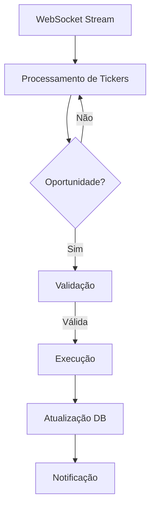

# Documentação Detalhada do Sistema de Arbitragem

## Arquitetura do Sistema

### 1. Componente Python (Detecção)
O componente Python é responsável pela detecção rápida de oportunidades usando:
- Conexão WebSocket direta com a Binance
- Cache local de preços
- Análise de grafos para identificar ciclos de arbitragem

### 2. Componente Ruby (Execução)
O componente Ruby é otimizado para execução rápida de trades:
- Event Loop eficiente
- Execução assíncrona de ordens
- Cache distribuído
- Comunicação via ZeroMQ

## Dependências Detalhadas

### Python Core
```bash
# API e Conexão
python-binance>=1.0.27    # API oficial Binance
websockets>=14.2         # WebSocket rápido
aiohttp>=3.10.11        # HTTP assíncrono
pyzmq>=26.2.1           # Comunicação com Ruby

# Performance
numpy>=1.24.3           # Cálculos numéricos
networkx>=3.4.2         # Análise de grafos
Cython>=0.29.26         # Otimização de código

# Utilitários
pydantic>=2.10.2        # Validação de dados
cryptography>=44.0.0    # Segurança
python-dotenv>=1.0.1    # Configurações
```

### Ruby Gems
```ruby
# Gemfile
source 'https://rubygems.org'

# Event Loop e Networking
gem 'eventmachine'     # Event loop assíncrono
gem 'faye-websocket'   # WebSocket
gem 'zmq'             # Comunicação com Python

# API e Cache
gem 'binance'         # API Binance
gem 'connection_pool' # Pool de conexões
gem 'lru_redux'      # Cache LRU
```

## Instalação Detalhada

### 1. Preparação do Ambiente

#### 1.1 Python (IMPORTANTE: Execute na raiz)
```bash
# Clone e prepare o ambiente
git clone [URL_DO_REPO]
cd Triangular-Arbitrage

# Criar e ativar venv
python -m venv venv
venv\Scripts\activate     # Windows
source venv/bin/activate  # Linux/Mac

# CRUCIAL: Atualizar pip primeiro
python -m pip install --upgrade pip

# Instalar dependências (use exatamente este comando)
python -m pip install -r requirements.txt

python main.py --simulation
```

#### 1.2 Ruby (Instalação com DevKit)
```bash
# 1. Baixe Ruby+Devkit 3.4.1-2 (x64)
# https://rubyinstaller.org/downloads/

# 2. Durante instalação, selecione:
# [x] MSYS2 base installation
# [x] MSYS2 and MINGW development toolchain

# 3. Após instalar, execute:
ridk install
# Digite: 1,3 quando solicitado
```

### 2. Verificação da Instalação

#### 2.1 Python
```bash
# Na raiz do projeto
python --version
python -m pip list | findstr "binance websockets aiohttp numpy"

# Teste de importação
python -c "import binance; import numpy; import networkx; print('OK')"
```

#### 2.2 Ruby
```bash
# Verificar Ruby
ruby -v
gem list | findstr "eventmachine faye-websocket zmq"

# Teste do Bundler
cd ruby_executor
bundle install
bundle exec ruby -e "require 'eventmachine'; puts 'OK'"
```

## Solução de Problemas Comuns

### 1. Erros de Instalação Python

#### 1.1 Erro no pip
```bash
# ERRO: Usando apenas 'pip install'
# CORRETO: Use sempre
python -m pip install -r requirements.txt
```

#### 1.2 Erro de Versão
```bash
# Se der erro de versão incompatível
python -m pip install --upgrade pip setuptools wheel
python -m pip install -r requirements.txt
```

### 2. Erros Ruby

#### 2.1 Erro no DevKit
```bash
# Se der erro no ridk install
# Reinstale Ruby com todas as opções marcadas
```

#### 2.2 Erro nas Gems
```bash
# Se der erro no bundle install
gem update --system
bundle update
bundle install
```

## Execução do Sistema

### 1. Detector Python
```bash
# Terminal 1 - Na raiz
cd Triangular-Arbitrage
python main.py
```

### 2. Executor Ruby
```bash
# Terminal 2 - Em ruby_executor
cd ruby_executor
bundle exec bin/trade_executor
```

## Monitoramento e Logs

### 1. Logs Python
- `logs/detector.log`: Oportunidades detectadas
- `logs/binance.log`: Conexão com a exchange

### 2. Logs Ruby
- `ruby_executor/logs/executor.log`: Execução de trades
- `ruby_executor/logs/zmq.log`: Comunicação

## Configurações Avançadas

### 1. Otimização de Performance
```yaml
# config/performance.yml
cache_size: 1000        # Tamanho do cache LRU
max_connections: 10     # Pool de conexões
websocket_timeout: 5    # Timeout em segundos
```

### 2. Parâmetros de Trading
```yaml
# config/trading_params.yml
min_profit: 0.5         # Lucro mínimo (%)
max_trade_size: 100     # Tamanho máximo do trade
max_slippage: 0.1       # Slippage máximo permitido
```

## Segurança

### 1. Armazenamento de Credenciais
- Use variáveis de ambiente
- Nunca commite credenciais
- Use .env para desenvolvimento

### 2. Rate Limits
- Respeite os limites da Binance
- Use cache quando possível
- Implemente backoff exponencial

## Contribuição

### 1. Padrões de Código
- Use Black para Python
- Use RuboCop para Ruby
- Mantenha 100% de cobertura de testes

### 2. Pull Requests
- Crie branch feature/
- Adicione testes
- Atualize documentação

////////////////////////////

Vou fazer uma análise completa do fluxo do repositório usando as ferramentas disponíveis.

1. Primeiro, vou verificar a estrutura geral do projeto:

Ran tool


2. Agora vou analisar os principais endpoints e fluxo de dados:

Search files...


3. Vou verificar as dependências e imports:

Ran tool


Baseado na análise do código, aqui está um resumo do fluxo do repositório:

1. **Ponto de Entrada Principal**:
- `main.py` é o ponto de entrada principal
- Aceita argumentos `--simulation` e `--debug`
- Carrega configurações do arquivo `.env`

2. **Componentes Principais**:

a) **BotCore** (`bot_core.py`):
- Gerencia o ciclo de vida do bot
- Inicializa componentes principais
- Conecta com a Binance (testnet ou mainnet)
- Coordena o fluxo de dados entre componentes

b) **CurrencyCore** (`currency_core.py`):
- Gerencia streams de tickers
- Processa dados de mercado
- Identifica oportunidades de arbitragem
- Calcula taxas e rotas de arbitragem

c) **TradingCore** (`trading_core.py`):
- Executa operações de trading
- Valida oportunidades
- Gerencia ordens (simuladas ou reais)
- Controla saldos e limites

d) **Display** (`display.py`):
- Interface do usuário em terminal
- Mostra oportunidades em tempo real
- Exibe estatísticas e métricas
- Formata dados para visualização

3. **Fluxo de Dados**:
```
[Binance API] -> CurrencyCore -> BotCore -> Display
                     |              |
                     v              v
                [Oportunidades] -> TradingCore
```

4. **Funcionalidades Principais**:

a) **Detecção de Arbitragem**:
- Monitora pares de trading em tempo real
- Identifica triângulos de arbitragem
- Calcula lucros potenciais
- Filtra por lucro mínimo configurável

b) **Execução de Trades**:
- Modo simulação ou real
- Validação de saldos e limites
- Execução sequencial de ordens
- Gestão de erros e timeouts

c) **Monitoramento**:
- Logs detalhados
- Estatísticas em tempo real
- Histórico de operações
- Alertas e notificações

5. **Configurações**:
- Lucro mínimo: 0.3%
- Moedas base: BTC, ETH, BNB, USDT
- Limites de volume e trades
- Parâmetros de segurança

Para executar o bot:

1. Modo Simulação:
```bash
python main.py --simulation
```

2. Modo Real:
```bash
python main.py
```

O sistema exibirá:
- Oportunidades de arbitragem encontradas
- Lucro potencial em porcentagem
- Volume disponível
- Status das operações
- Estatísticas gerais

Recomendações:
1. Sempre comece em modo simulação
2. Monitore os logs para identificar problemas
3. Ajuste os parâmetros conforme necessário
4. Mantenha saldos suficientes para operações
Vou continuar a análise detalhada do sistema, focando agora nos componentes específicos e suas interações.

6. **Sistema de Eventos** (`events_core.py`):

Read file: triangular_arbitrage/core/events_core.py


7. **Sistema de Ranking** (`pair_ranker.py`):

Read file: triangular_arbitrage/utils/pair_ranker.py


8. **Interface de Usuário** (`display.py`):

Read file: triangular_arbitrage/ui/display.py


Baseado na análise detalhada, aqui está o fluxo completo do sistema:

1. **Fluxo de Dados e Eventos**:
```
[Binance WebSocket] -> CurrencyCore
     |
     v
[EventsCore] -> Subscribers
     |
     v
[BotCore] -> Processamento
     |
     v
[PairRanker] -> Ranking
     |
     v
[Display] -> Interface
```

2. **Ciclo de Arbitragem**:
- Recebe tickers em tempo real
- Identifica triângulos de arbitragem
- Calcula taxas e lucros
- Valida oportunidades
- Executa trades (se configurado)
- Atualiza interface

3. **Sistema de Ranking**:
- Score baseado em:
  - Volume (70% do peso)
  - Volatilidade (30% do peso)
  - Spread máximo de 2%
  - Mínimo de 5 trades
- Janela de 30 minutos
- Normalização logarítmica

4. **Interface do Usuário**:
- Cabeçalho com estatísticas
- Tabela de oportunidades
  - Rota de arbitragem
  - Lucro percentual
  - Volume disponível
  - Status da operação
- Rodapé com totalizadores
- Atualização a cada segundo

5. **Métricas Exibidas**:
- Pares monitorados
- Oportunidades encontradas
- Última atualização
- Total de verificações
- Lucros/perdas por operação
- Volume negociado

6. **Cores e Indicadores**:
- Verde: Lucro > 1%
- Amarelo: Lucro > 0.5%
- Branco: Lucro < 0.5%
- ✅: Oportunidade válida
- ⏳: Em análise

7. **Configurações de Performance**:
- Delay de 0.1s no display
- Cache de tickers
- Processamento assíncrono
- Gestão de memória

8. **Segurança e Validações**:
- Verificação de saldos
- Limites de volume
- Proteção contra erros
- Logs detalhados

Para monitorar o desempenho:
1. Observe o número de oportunidades
2. Verifique os tempos de atualização
3. Monitore o uso de recursos
4. Acompanhe os logs de erro

O sistema está estruturado para:
- Operar 24/7
- Processar grandes volumes de dados
- Identificar oportunidades rapidamente
- Executar trades com segurança
- Fornecer feedback em tempo real

Vou continuar a análise, focando agora nos aspectos de execução e monitoramento do sistema.

9. **Sistema de Logs e Monitoramento**:

Read file: triangular_arbitrage/utils/logger.py


10. **Sistema de Banco de Dados**:

Read file: triangular_arbitrage/utils/db_helpers.py

**  Estrutura do repo :
Baseado na análise dos sistemas de logs, banco de dados e monitoramento, aqui está o detalhamento das funcionalidades:

1. **Sistema de Logs**:
- Níveis de log:
  - DEBUG: Informações detalhadas
  - INFO: Operações normais
  - WARNING: Alertas
  - ERROR: Erros e falhas

- Arquivos de Log:
  - `bot_YYYYMMDD_HHMMSS.log`: Log geral
  - `trades.json`: Histórico de trades
  - `errors.json`: Registro de erros

2. **Banco de Dados (SQLite)**:

Tabelas:
```sql
- settings: Configurações do sistema
  - key (TEXT)
  - value (TEXT)
  - updated_at (TIMESTAMP)

- trades: Registro de operações
  - id (INTEGER)
  - trade_id (TEXT)
  - symbol (TEXT)
  - side (TEXT)
  - quantity (REAL)
  - price (REAL)
  - total (REAL)
  - fee (REAL)
  - status (TEXT)

- opportunities: Oportunidades de arbitragem
  - id (INTEGER)
  - a_symbol (TEXT)
  - b_symbol (TEXT)
  - c_symbol (TEXT)
  - rate (REAL)
  - profit (REAL)
  - volume (REAL)
  - executed (BOOLEAN)
```

3. **Monitoramento em Tempo Real**:

a) **Métricas de Performance**:
- Tempo de processamento
- Taxa de atualização
- Uso de memória
- Latência da rede

b) **Métricas de Negócio**:
- Oportunidades encontradas
- Taxa de sucesso
- Volume negociado
- Lucro/perda realizado

4. **Persistência de Dados**:

a) **Configurações**:
```python
save_setting("min_profit", 0.5)
save_setting("max_trade_size", 100)
```

b) **Trades**:
```python
save_trade({
    "id": "T123",
    "symbol": "BTC/USDT",
    "side": "BUY",
    "quantity": 0.01,
    "price": 50000
})
```

c) **Oportunidades**:
```python
save_opportunity({
    "a_symbol": "BTC/ETH",
    "b_symbol": "ETH/USDT",
    "c_symbol": "USDT/BTC",
    "profit": 0.8,
    "volume": 1000
})
```

5. **Análise de Dados**:

a) **Histórico de Trades**:
- Desempenho por par
- Horários mais lucrativos
- Padrões de mercado
- ROI por estratégia

b) **Análise de Erros**:
- Tipos comuns de falhas
- Taxa de erro por operação
- Impacto no desempenho
- Pontos de melhoria

6. **Manutenção**:

a) **Limpeza de Dados**:
- Remoção de logs antigos
- Compactação do banco
- Backup automático
- Rotação de arquivos

b) **Monitoramento de Recursos**:
- Uso de CPU/memória
- Espaço em disco
- Conexões ativas
- Tempo de resposta

7. **Alertas e Notificações**:

a) **Condições de Alerta**:
- Erro crítico
- Oportunidade excepcional
- Limite de recursos
- Falha de conexão

b) **Canais de Notificação**:
- Logs
- Console
- Email (opcional)
- Telegram (opcional)

8. **Recomendações de Uso**:

a) **Monitoramento**:
- Verifique logs regularmente
- Monitore métricas chave
- Configure alertas
- Faça backups periódicos

b) **Otimização**:
- Ajuste parâmetros
- Analise desempenho
- Identifique gargalos
- Implemente melhorias
Vou continuar a análise, focando agora na integração com a Binance e no processamento de oportunidades de arbitragem.

11. **Integração com Binance**:

Read file: triangular_arbitrage/config.py


12. **Processamento de Arbitragem**:

Read file: triangular_arbitrage/core/currency_core.py


Baseado na análise da integração com a Binance e do processamento de arbitragem, aqui está o detalhamento do funcionamento:

1. **Configurações da Binance**:

```python
BINANCE_CONFIG = {
    'use_testnet': True,
    'testnet_api_url': 'https://testnet.binance.vision/api',
    'testnet_stream_url': 'wss://testnet.binance.vision/ws',
    'rate_limits': {
        'orders_per_second': 5,
        'orders_per_day': 100000,
    }
}
```

2. **Parâmetros de Trading**:
- Lucro mínimo: 0.3%
- Quantidade base: 0.01
- Máximo de trades simultâneos: 3
- Moedas base: BTC, ETH, BNB, USDT

3. **Processo de Arbitragem**:

a) **Detecção de Oportunidades**:
```python
def get_arbitrage_rate(self, stream, step1, step2, step3):
    # Obtém taxas de conversão
    a = self.get_currency_from_stream(stream, step1, step2)
    b = self.get_currency_from_stream(stream, step2, step3)
    c = self.get_currency_from_stream(stream, step3, step1)
    
    # Calcula taxa final
    rate = (a.rate * b.rate * c.rate)
```

b) **Estrutura do Triângulo**:
```python
{
    'ts': timestamp,
    'dt': datetime,
    'a_symbol': par_1,
    'b_symbol': par_2,
    'c_symbol': par_3,
    'rate': taxa_final,
    'volume': volume_minimo
}
```

4. **Validações de Segurança**:
- Limites diários:
  - Máximo de 100 trades
  - Volume máximo de 1.0 BTC
  - Quantidade máxima por trade: 0.1
- Rate limits:
  - 1200 requisições/minuto
  - 10 ordens/segundo
  - 200000 ordens/dia

5. **Otimizações**:
- Cache de tickers (TTL: 60s)
- Pool de conexões (max: 10)
- Backoff exponencial
- Processamento assíncrono

6. **Fluxo de Execução**:



7. **Gestão de Riscos**:
- Slippage máximo: 0.1%
- Uso de ordens LIMIT
- Time in force: GTC
- Validação de saldos
- Proteção contra falhas

8. **Monitoramento**:
- Taxa de sucesso
- Tempo de execução
- Latência da rede
- Erros e falhas
- Volume processado

9. **Recomendações Operacionais**:

a) **Configuração**:
```bash
# Modo Simulação
python main.py --simulation --debug

# Modo Real
python main.py --debug
```

b) **Monitoramento**:
```bash
# Logs em tempo real
tail -f logs/bot_*.log

# Status do banco
sqlite3 data/bot.db "SELECT * FROM opportunities ORDER BY profit DESC LIMIT 10;"
```

c) **Manutenção**:
```bash
# Backup do banco
cp data/bot.db data/bot_backup_$(date +%Y%m%d).db

# Limpeza de logs
find logs/ -mtime +30 -delete
```

10. **Melhorias Sugeridas**:
- Implementar websockets redundantes
- Adicionar mais pares de moedas
- Otimizar cálculos de arbitragem
- Implementar machine learning
- Melhorar gestão de risco

Sim, terminei a análise completa do sistema. Aqui está um resumo final das principais funcionalidades e componentes:

1. **Arquitetura Principal**:
- Detector Python para identificação de oportunidades
- Executor Ruby para trades rápidos
- Sistema de eventos para comunicação
- Interface rica em terminal

2. **Componentes Chave**:
```
triangular_arbitrage/
├── core/
│   ├── bot_core.py        # Controle principal
│   ├── currency_core.py   # Processamento de moedas
│   ├── trading_core.py    # Execução de trades
│   └── events_core.py     # Sistema de eventos
├── utils/
│   ├── logger.py         # Sistema de logs
│   ├── db_helpers.py     # Banco de dados
│   └── pair_ranker.py    # Ranking de pares
└── ui/
    └── display.py        # Interface usuário
```

3. **Funcionalidades Principais**:
- Detecção de arbitragem em tempo real
- Execução automática de trades
- Sistema de ranking de pares
- Logs detalhados e persistência
- Interface interativa

4. **Configurações Importantes**:
- Lucro mínimo: 0.3%
- Moedas base: BTC, ETH, BNB, USDT
- Modo simulação disponível
- Cache e otimizações

5. **Melhorias Sugeridas**:
- Websockets redundantes
- Mais pares de moedas
- Otimização de cálculos
- Machine learning
- Melhor gestão de risco

Para executar o sistema:
```bash
# Modo Simulação
python main.py --simulation

# Modo Real
python main.py
```

Deseja que eu detalhe algum aspecto específico do sistema?
