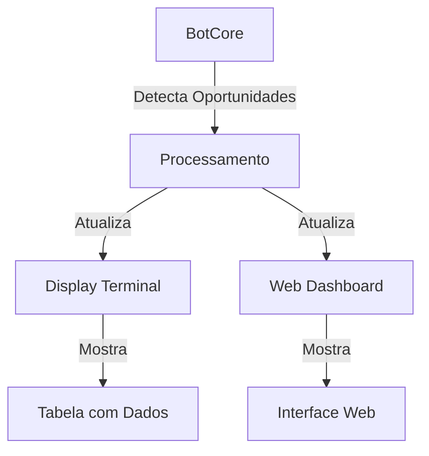

# Plano de Ajustes - Display e Dashboard

## Problema Atual
- Dashboard web não está iniciando
- Tabela do terminal está com problemas de formatação
- Dados não estão sendo exibidos em tempo real
- Estrutura da tabela existe mas dados não aparecem corretamente

## Fluxo de Dados


## Estrutura da Tabela
- Rota de Arbitragem (path)
- Profit Esperado (expected_profit)
- Profit Real (real_profit)
- Slippage
- Tempo de Execução
- Liquidez
- Risco
- Spread
- Volatilidade
- Confiança

## Etapas de Correção

### 1. Display Terminal (display.py)
- [x] Remover código redundante
- [x] Implementar tabela única e limpa
- [x] Configurar atualizações em tempo real via Rich Live
- [x] Garantir alinhamento correto das colunas
- [x] Implementar formatação consistente dos dados
- [x] Validar exibição de emojis e cores

### 2. BotCore (bot_core.py)
- [x] Corrigir inicialização do display
- [ ] Implementar formatação correta dos dados
- [ ] Centralizar envio de atualizações
- [ ] Remover chamadas redundantes
- [ ] Validar dados antes do envio
- [ ] Implementar tratamento de erros

### 3. Estrutura de Dados
- [ ] Criar modelo único de dados
```python
OpportunityData = {
    'path': str,
    'profit': float,
    'real_profit': float,
    'slippage': float,
    'execution_time': float,
    'liquidity': float,
    'risk_score': float,
    'spread': float,
    'volatility': float,
    'confidence': float
}
```

### 4. Sistema de Atualização
- [ ] Implementar websockets para dashboard
- [ ] Configurar Live do Rich para terminal
- [ ] Sincronizar atualizações
- [ ] Implementar controle de taxa de atualização
- [ ] Adicionar buffer para dados

### 5. Validação e Testes
- [ ] Testar inicialização do sistema
- [ ] Verificar atualizações em tempo real
- [ ] Validar sincronização terminal/web
- [ ] Testar todos os campos de dados
- [ ] Verificar formatação e alinhamento
- [ ] Testar em diferentes resoluções de terminal

## Métricas de Sucesso
1. Display inicia corretamente
2. Dados são atualizados em tempo real
3. Todas as colunas são exibidas corretamente
4. Terminal e web mostram os mesmos dados
5. Não há duplicação de atualizações
6. Sistema permanece estável durante operação

## Notas Importantes
- Manter compatibilidade com sistema existente
- Garantir performance das atualizações
- Priorizar estabilidade do display
- Manter código limpo e documentado
- Evitar alterações desnecessárias no core

ATENÇÃO !!!! Inicie aqui a cada estapa concluida : Não mude os itens e subitens  do ajustes jamais, voce deve inprementar todos esses itens usando as melhores praticas sempre  mantendo o restante do repo e focando nos objetivos de ajustes sem fazer mudanças radicas que possam prejudicar o repo, use os aquivos e pastas do repo e não crie arquivos desnecessarios, vc nao pode fazer nada sem antes consultar o ajustes.md , faça por etapa de eliminaçao marcando os itens imprementados com um (x),antes de marcar teste as iprementações buscando a existencias de erros, na ausencia de erros  passe para proxima etapa ate terminar o objetivo de ajustes.md sem sair deste roteiro ou sera severamente penalizado.