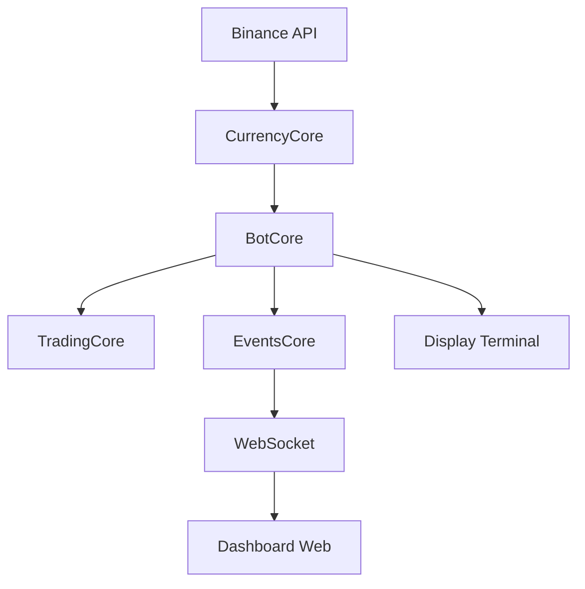

# Arquitetura do Sistema de Arbitragem Triangular

## Instalação e Configuração

### Ambiente Virtual
```bash
# Criar ambiente virtual
python -m venv venv

# Ativar (Windows)
.\venv\Scripts\activate

# Ativar (Linux/Mac)
source venv/bin/activate

# Instalar dependências
pip install -r requirements.txt
```

### Configuração do Ambiente
```bash
# Copiar arquivo de exemplo
cp .env.example .env

# Editar .env com suas credenciais da Binance
BINANCE_API_KEY=sua_api_key_aqui
BINANCE_API_SECRET=seu_api_secret_aqui
```

### Execução
### Estrutura do Projeto
```
triangular_arbitrage/
├── core/                     # Componentes principais
│   ├── bot_core.py          # Controle central
│   ├── currency_core.py     # Integração Binance
│   ├── trading_core.py      # Execução de trades
│   └── events_core.py       # Sistema de eventos
├── ui/                      # Interface do usuário
│   ├── web/                # Dashboard web
│   │   ├── app.py         # Servidor FastAPI
│   │   ├── auth.py        # Autenticação
│   │   └── static/        # Assets web
│   └── display.py         # Display terminal
└── utils/                  # Utilitários
    ├── backup_manager.py   # Gestão de backups
    ├── db_helpers.py      # Banco de dados
    ├── logger.py          # Sistema de logs
    ├── pair_ranker.py     # Ranking de pares
    └── rate_limiter.py    # Controle de taxa
```

### Fluxo de Dados


### Database Schema
```sql
-- Oportunidades detectadas
CREATE TABLE opportunities (
    id INTEGER PRIMARY KEY,
    timestamp TEXT,
    a_step_from TEXT,
    a_step_to TEXT,
    b_step_from TEXT,
    b_step_to TEXT,
    c_step_from TEXT,
    c_step_to TEXT,
    rate REAL,
    profit REAL,
    volume REAL
);

-- Trades executados
CREATE TABLE trades (
    id INTEGER PRIMARY KEY,
    timestamp TEXT,
    route TEXT,
    profit REAL,
    status TEXT,
    error TEXT
);

-- Configurações
CREATE TABLE settings (
    key TEXT PRIMARY KEY,
    value TEXT,
    updated_at TEXT
);
```

### Componentes Core

#### BotCore (bot_core.py)
- Inicializa e coordena todos os componentes
- Gerencia ciclo de vida do sistema
- Mantém estado global e configurações
- Coordena comunicação entre módulos

#### CurrencyCore (currency_core.py)
- Conexão direta com Binance
- Monitoramento de preços em tempo real
- Detecção de oportunidades de arbitragem
- Normalização de volumes e cálculos

#### TradingCore (trading_core.py)
- Validação e execução de trades
- Gestão de saldo e risco
- Controle de ordens
- Cálculos de lucro/perda

#### EventsCore (events_core.py)
- Sistema de eventos pub/sub
- Notificações em tempo real
- Comunicação assíncrona
- Broadcast de atualizações

### Interface Web

#### Dashboard (app.py)
- Servidor FastAPI
- Autenticação JWT
- WebSocket para updates
- Endpoints REST

#### Endpoints Principais
```
GET  /              → Dashboard principal
GET  /config        → Página de configurações
GET  /api/config    → Configurações atuais
POST /api/config    → Atualizar configurações
GET  /api/status    → Status do sistema
WS   /ws           → Updates em tempo real
```

### Funcionamento

1. **Inicialização**:
   - Carrega configurações do .env
   - Conecta ao banco SQLite
   - Inicia componentes core
   - Inicia servidor web

2. **Monitoramento**:
   - CurrencyCore recebe dados Binance
   - Processa oportunidades em tempo real
   - Notifica via sistema de eventos
   - Atualiza interfaces (web/terminal)

3. **Trading**:
   - Validação de oportunidades
   - Verificação de saldo/limites
   - Execução de ordens (se test_mode=False)
   - Registro de operações

### Configurações do Sistema

#### Variáveis de Ambiente (.env)
```bash
# Credenciais Binance
BINANCE_API_KEY=***
BINANCE_API_SECRET=***

# Configurações do Bot
TEST_MODE=true            # Modo de teste ativo
DEBUG_MODE=false          # Modo debug
SAVE_DATA=true           # Salvar dados para análise
```

#### Parâmetros de Trading (config.py)
```python
TRADING_CONFIG = {
    'test_mode': True,       # Modo de teste (não executa ordens)
    'min_profit': 0.2,       # Lucro mínimo (%)
    'max_slippage': 0.002,   # Slippage máximo
    'fee_rate': 0.001,       # Taxa por operação
    'min_volume_btc': 0.01   # Volume mínimo em BTC
}
```

### Segurança e Monitoramento

#### Proteções Implementadas
- Rate limiting por IP/usuário
- Autenticação JWT para API/Dashboard
- Validação de inputs
- Backup automático de dados
- Logs estruturados
- Controle de concorrência

#### Monitoramento em Tempo Real
- Status do sistema
- Oportunidades detectadas
- Trades executados
- Erros e warnings
- Performance e latência
- Uso de recursos

#### Logs e Diagnósticos
```
data/
├── arbitrage.db         # Banco de dados SQLite
├── logs/               # Logs do sistema
│   ├── bot.log        # Log principal
│   └── error.log      # Erros e warnings
└── backups/           # Backups automáticos
```

### Modo de Operação

1. **Modo de Monitoramento (TEST_MODE=true)**
   - Conecta à API real da Binance
   - Monitora mercados em tempo real
   - Detecta oportunidades reais
   - Não executa ordens
   - Ideal para validar estratégias

2. **Modo de Execução (TEST_MODE=false)**
   - Conecta à API real da Binance
   - Monitora mercados em tempo real
   - Detecta oportunidades reais
   - Executa ordens reais
   - Requer atenção e monitoramento

3. **Modo Debug (DEBUG_MODE=true)**
   - Logs detalhados
   - Métricas adicionais
   - Validações extras
   - Stack traces completos

4. **Persistência**:
   - Logs estruturados
   - Backup automático
   - Histórico de operações
   - Configurações do sistema
```bash
# Iniciar o sistema
python main.py

# Acessar dashboard
http://localhost:8000
```

## 1. Componentes Core

### BotCore (bot_core.py)
- Componente central que coordena todas as operações
- Gerencia ciclo de vida do bot
- Inicializa e coordena outros componentes
- Mantém estado global do sistema

### CurrencyCore (currency_core.py)
- Conexão com Binance via WebSocket
- Monitoramento de preços em tempo real
- Detecção de oportunidades de arbitragem
- Cálculos de taxas e lucros

### TradingCore (trading_core.py)
- Execução de ordens
- Gestão de saldos
- Validação de trades
- Controle de riscos

### EventsCore (events_core.py)
- Sistema de eventos pub/sub
- Comunicação entre componentes
- Notificações assíncronas
- Pipeline de eventos

## 2. Interface Web

### WebDashboard (web/app.py)
- Interface web FastAPI
- Autenticação JWT
- WebSocket para updates
- Visualização de dados

### Rotas de API
```
GET  /              → Dashboard principal
GET  /config        → Página de configurações
GET  /api/config    → Buscar configurações
POST /api/config    → Atualizar configurações
GET  /api/status    → Status do bot
WS   /ws           → Updates em tempo real
```

### Sistema de Autenticação
- JWT tokens
- Proteção de rotas
- Gestão de usuários
- Rate limiting

## 3. Banco de Dados

### DBHelpers (utils/db_helpers.py)
- SQLite assíncrono
- Armazenamento de:
  * Oportunidades
  * Trades executados
  * Configurações
  * Logs

### Tabelas Principais
```sql
opportunities (
    timestamp, 
    a_step_from, a_step_to,
    b_step_from, b_step_to,
    c_step_from, c_step_to,
    rate, profit, volume
)

trades (
    timestamp,
    pairs,
    amounts,
    rates,
    profit,
    status
)
```

## 4. Fluxo de Dados

### Detecção de Oportunidades
```
Binance WebSocket → CurrencyCore 
    → Processamento de tickers
    → Detecção de arbitragens
    → Notificação via eventos
```

### Execução de Trades
```
Oportunidade detectada → Validação
    → Verificação de saldos
    → Execução de ordens
    → Atualização de estado
    → Notificação de resultado
```

### Updates em Tempo Real
```
Eventos do sistema → EventsCore
    → WebSocket broadcast
    → Atualização do dashboard
    → Notificações
```

## 5. Configuração e Inicialização

### Arquivo Principal (main.py)
1. Carrega variáveis de ambiente
2. Inicializa logging
3. Configura banco de dados
4. Inicia componentes core
5. Inicia servidor web
6. Configura handlers de shutdown

### Configurações (config.py)
- Parâmetros de trading
- Limites e thresholds
- Configurações de conexão
- Parâmetros de segurança

## 6. Dependências Críticas

### Python
- FastAPI: Servidor web e API
- aiohttp: Requisições assíncronas
- python-binance: API Binance
- SQLAlchemy: ORM
- aiosqlite: Banco de dados assíncrono
- WebSocket: Updates em tempo real

### JavaScript
- Chart.js: Gráficos interativos
- TailwindCSS: Estilização
- WebSocket: Conexão em tempo real

## 7. Fluxo de Operação

1. **Inicialização**:
   ```
   main.py → Carrega configs
        → Inicia BotCore
        → Inicia WebDashboard
        → Conecta à Binance
   ```

2. **Monitoramento**:
   ```
   CurrencyCore → Recebe tickers
        → Analisa oportunidades
        → Notifica eventos
        → Atualiza dashboard
   ```

3. **Execução**:
   ```
   TradingCore → Valida oportunidade
        → Executa ordens
        → Registra resultados
        → Atualiza estado
   ```

4. **Interface**:
   ```
   WebDashboard → Autenticação
        → Mostra oportunidades
        → Updates em tempo real
        → Configurações
   ```

## 8. Pontos de Atenção

1. **Concorrência**:
   - Operações assíncronas
   - Race conditions
   - Estado compartilhado
   - Lock management

2. **Segurança**:
   - Autenticação JWT
   - Rate limiting
   - Validação de inputs
   - Proteção de credenciais

3. **Performance**:
   - Cache de dados
   - Otimização de queries
   - Gestão de conexões
   - Memory leaks

4. **Resiliência**:
   - Retry mechanisms
   - Circuit breakers
   - Error handling
   - Backups automáticos